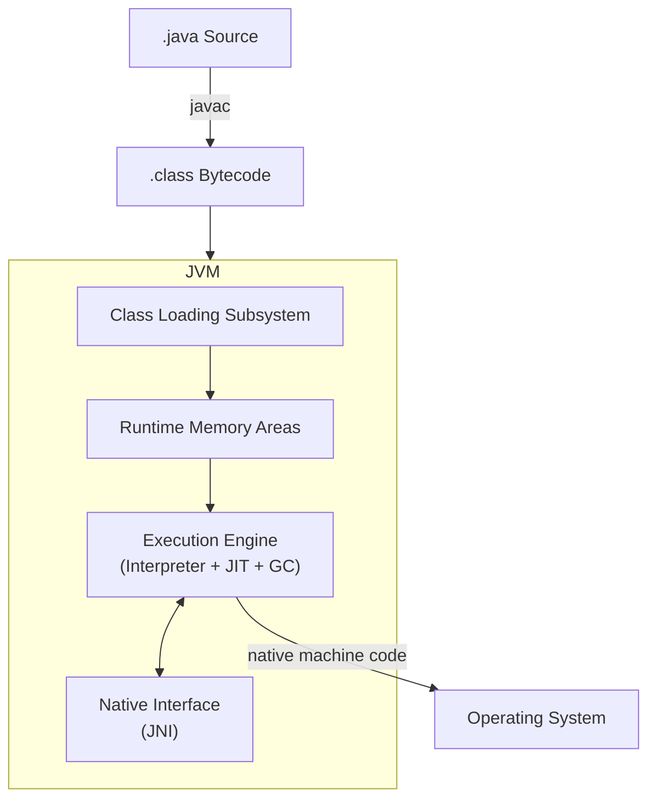
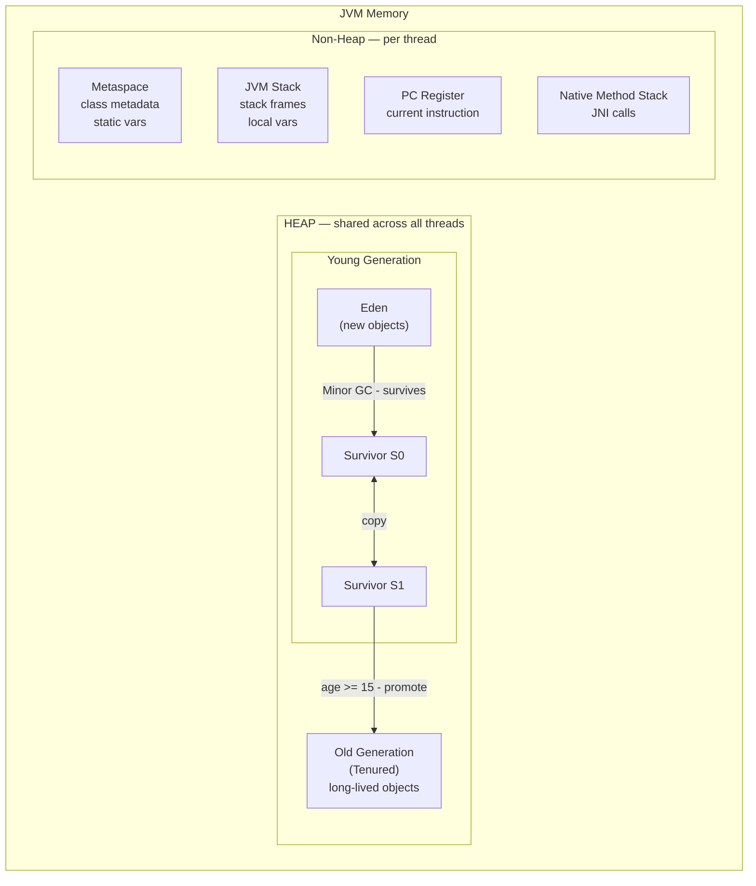
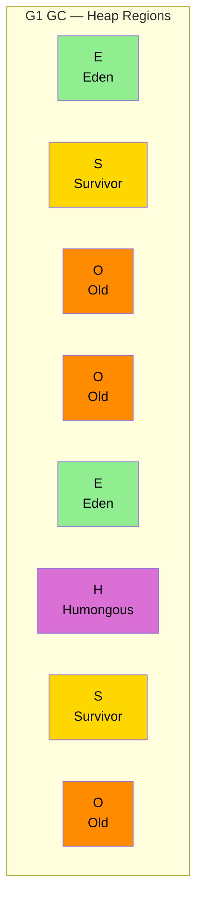

# JVM Internals

## Table of Contents
1. [JVM Architecture Overview](#jvm-architecture-overview)
2. [Class Loading Subsystem](#class-loading-subsystem)
3. [Runtime Memory Areas](#runtime-memory-areas)
4. [Execution Engine](#execution-engine)
5. [Garbage Collection](#garbage-collection)
6. [GC Algorithms](#gc-algorithms)
7. [Quick Reference](#quick-reference)

---

## JVM Architecture Overview



**Flow:** `.java` → `javac` → `.class` (bytecode) → JVM loads → JIT compiles → runs on OS

---

## Class Loading Subsystem
### Three Phases

```
Loading → Linking (Verify → Prepare → Resolve) → Initialization
```

| Phase | What happens |
|---|---|
| **Loading** | Reads `.class` file, creates `Class<?>` object in heap |
| **Verification** | Validates bytecode is safe and well-formed |
| **Preparation** | Allocates memory for static fields, sets default values |
| **Resolution** | Resolves symbolic references to actual memory addresses |
| **Initialization** | Runs static initializers, assigns static field values |

### ClassLoader Hierarchy

```
Bootstrap ClassLoader        (loads java.lang.*, rt.jar)
    └── Extension ClassLoader    (loads lib/ext/*.jar)
            └── Application ClassLoader  (loads your app's classpath)
                    └── Custom ClassLoader (plugins, hot reload)
```

**Parent Delegation Model** — A ClassLoader always asks its parent first before loading a class. Prevents duplicate/malicious class loading.

```java
ClassLoader cl = MyClass.class.getClassLoader();
System.out.println(cl);                     // sun.misc.Launcher$AppClassLoader
System.out.println(cl.getParent());         // sun.misc.Launcher$ExtClassLoader
System.out.println(cl.getParent().getParent()); // null (Bootstrap — native C code)
```

---

## Runtime Memory Areas



### Memory Areas Explained

| Area | Shared? | Stores | GC'd? |
|---|---|---|---|
| **Heap** | All threads | Objects, instance variables | Yes |
| **Stack** | Per thread | Stack frames, local variables, method calls | No (auto) |
| **Metaspace** | All threads | Class metadata, static vars (Java 8+ replaced PermGen) | Partially |
| **PC Register** | Per thread | Address of current executing instruction | No |
| **Native Method Stack** | Per thread | Native (C/C++) method calls via JNI | No |

### Heap Generations

| Generation | Contains | GC type |
|---|---|---|
| **Eden** | Newly created objects | Minor GC |
| **Survivor (S0/S1)** | Objects that survived Eden GC (age++) | Minor GC |
| **Old / Tenured** | Promoted objects (age ≥ 15 by default) | Major GC |

> **StackOverflowError** → Stack is full (infinite/deep recursion)  
> **OutOfMemoryError: Java heap space** → Heap is full  
> **OutOfMemoryError: Metaspace** → Too many classes loaded

### String Pool

```java
String a = "hello";             // stored in String Pool (inside Heap)
String b = "hello";             // reuses same pool reference
String c = new String("hello"); // new object on Heap (outside pool)

System.out.println(a == b);     // true  (same pool reference)
System.out.println(a == c);     // false (different objects)
System.out.println(a.equals(c));// true  (same content)

String d = c.intern();          // forces into pool, returns pool reference
System.out.println(a == d);     // true
```

---

## Execution Engine

| Component | Role |
|---|---|
| **Interpreter** | Executes bytecode line by line — fast startup, slow execution |
| **JIT Compiler** | Compiles hot bytecode to native machine code at runtime |
| **HotSpot** | Detects frequently called methods ("hot spots") and JIT-compiles them |
| **GC** | Automatically manages heap memory |

### JIT Compilation Levels (HotSpot)

```
Level 0 → Interpreted
Level 1 → C1 compiled (fast compile, less optimized)
Level 2 → C1 (with invocation & back-edge counters)
Level 3 → C1 (with full profiling)
Level 4 → C2 compiled (aggressive optimizations — server compiler)
```

> Hot methods eventually reach **Level 4 (C2)** — this is where inlining, loop unrolling, escape analysis happen.

---

## Garbage Collection

### How GC Works

1. **Mark** — Identify all live objects reachable from GC roots
2. **Sweep** — Remove unreachable (dead) objects, reclaim memory
3. **Compact** — (optional) Move live objects together to prevent fragmentation

### GC Roots (reachability starting points)
- Local variables on thread stacks
- Static fields of loaded classes
- Active Java threads
- JNI references

### Object Promotion Flow

```
new Object()
    → Eden
    → (survives Minor GC) → Survivor S0/S1  [age = 1]
    → (survives more GCs) → Survivor S0/S1  [age++]
    → (age >= 15)         → Old Generation
    → (unreachable)       → Collected by Major/Full GC
```

### GC Types

| Type | Triggers when | Collects | Speed |
|---|---|---|---|
| **Minor GC** | Eden is full | Young Generation | Fast |
| **Major GC** | Old Gen is full | Old Generation | Slow |
| **Full GC** | Major GC + Metaspace full | Entire heap | Slowest — avoid |

> **Stop-The-World (STW)** — GC pauses ALL application threads. Minimizing STW pause is the #1 goal of modern GC algorithms.

---

## GC Algorithms

| GC | Java version | STW? | Focus |
|---|---|---|---|
| **Serial GC** | All | Full STW | Single-threaded, small heaps |
| **Parallel GC** | Java 8 default | Full STW | Max throughput, multi-threaded |
| **CMS** | Deprecated (Java 14) | Partial | Low pause (concurrent sweep) |
| **G1 GC** | Java 9+ default | Partial | Balanced pause + throughput |
| **ZGC** | Java 15+ (prod) | < 1ms | Ultra-low pause, scalable |
| **Shenandoah** | Java 12+ | Minimal | Low pause, concurrent compaction |

### G1 GC — Most Common in Interviews

- Divides heap into equal-sized **regions** (typically ~2048 regions)
- Collects regions with most garbage first — **Garbage First**
- Predictable pause time goal via `-XX:MaxGCPauseMillis=200`
- Default GC since **Java 9**



### Key JVM Flags

```bash
-Xms512m                         # Initial heap size
-Xmx2g                           # Max heap size
-Xss512k                         # Stack size per thread
-XX:+UseG1GC                     # Use G1 GC
-XX:+UseZGC                      # Use ZGC
-XX:MaxGCPauseMillis=200         # Target max GC pause (G1)
-XX:MetaspaceSize=256m           # Initial Metaspace size
-XX:+PrintGCDetails              # Log GC events
-XX:+HeapDumpOnOutOfMemoryError  # Dump heap on OOM for analysis
```

---

## Quick Reference

```
Memory:
  Heap        → objects & instance vars (shared, GC managed)
  Stack       → method frames, local vars (per thread, auto)
  Metaspace   → class metadata (replaced PermGen in Java 8)
  PC Register → current instruction pointer (per thread)

Heap generations:
  Eden → Survivor (S0 ↔ S1, age++) → Old Generation

GC types:
  Minor GC → Young Gen (fast)
  Major GC → Old Gen   (slow, STW)
  Full GC  → All       (slowest, avoid)

Default GC:
  Java 8  → Parallel GC
  Java 9+ → G1 GC
  Java 21 → G1 GC (ZGC production-ready)

ClassLoader order (parent-first delegation):
  Bootstrap → Extension → Application → Custom

JIT pipeline:
  Interpreter → C1 (fast compile) → C2 (optimized, hot methods)

Common errors:
  StackOverflowError          → deep/infinite recursion
  OutOfMemoryError: heap      → heap full / memory leak
  OutOfMemoryError: Metaspace → too many class definitions
```
